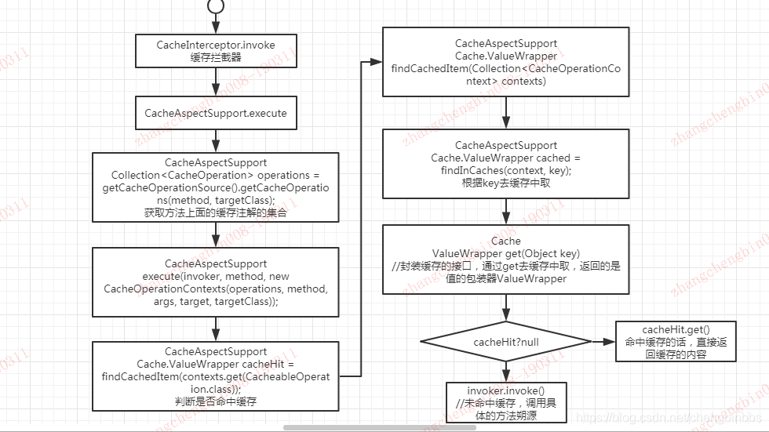

# Spring Caching
## 工作原理

### 1.首先看下EnableCaching注解
- 
    @Target(ElementType.TYPE)
    @Retention(RetentionPolicy.RUNTIME)
    @Documented
    @Import(CachingConfigurationSelector.class)
    public @interface EnableCaching {

	/**
	 * false JDK 动态代理   true cglib代理
	 */
	boolean proxyTargetClass() default false;

	/**
	 * 通知模式 JDK动态代理 或AspectJ
	 */
	AdviceMode mode() default AdviceMode.PROXY;

	/**
	 * 排序
	 */
	int order() default Ordered.LOWEST_PRECEDENCE;

}

- 此处引入了CachingConfigurationSelector类， 
  调用了selectImports根据mode选择Proxy和AspectJ -> 再调用 getProxyImports方法，引入了两个关键类
  - AutoProxyRegistrar
    注册一个自动代理创建者，registerBeanDefinitions -> registerAutoProxyCreatorIfNecessary -> 注册 InfrastructureAdvisorAutoProxyCreator类
    - InfrastructureAdvisorAutoProxyCreator类 动态代理后置处理器，是 SmartInstantiationAwareBeanPostProcessor  的实现类，也就是说它具备在每个实例对象创建前后进行拦截处理功能    
  - ProxyCachingConfiguration
    这个配置类注册了三个bean对象 
    - BeanFactoryCacheOperationSourceAdvisor -> 实现了PointcutAdvisor， 这也是AOP的三大要素：
      - Advisor 
      - Advice 通知
      - Pointcut 拦截点 （只是Pointcut是在BeanFactoryCacheOperationSourceAdvisor内部定义的）
    - CacheOperationSource 自定义缓存操作属性类 -> AnnotationCacheOperationSource
      AnnotationCacheOperationSource 该类读取了Spring的注解,SpringCacheAnnotationParser
      - Cacheable  如果没有缓存过，获取执行方法的返回结果；如果缓存过，则直接从缓存中获取，不再执行方法
      - CachePut   执行方法后，将方法返回结果存放到缓存中。不管有没有缓存过，执行方法都会执行，并缓存返回结果（unless可以否决进行缓存）。（当然，这里说的缓存都要满足condition条件）
      - CacheEvict 如果设置了beforeIntercepte则在方法执行前进行缓存删除操作，如果没有，则在执行方法调用完后进行缓存删除操作。
      - Caching
    - CacheInterceptor 拦截器 -> CacheAspectSupport -> MethodInterceptor ，实现了Spring Aop 的MethodInterceptor接口，MethodInterceptor是用来做方法拦截，
        
       具体执行流程如下：
    
    - 
    

