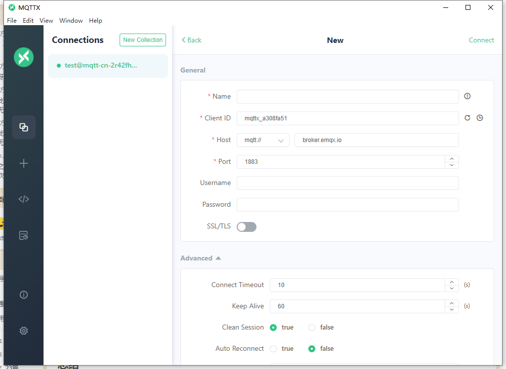

# Spring Boot MQTT 
### 1. MQTT 定义
    MQTT是一个基于客户端-服务器的消息发布/订阅传输协议 IBM研发的消息中间件，它工作在TCP/IP协议上，
    是为硬件性能低下的远程设备以及网络状况糟糕情况下而设计的，
    使用场景：机器与机器（M2M）、通信、物联网（loT）、智能家居

### 2.MQTT可视化工具
  - MQTT X

  - MQTT Explorer

### 3.spring boot 集成MQTT
  - 增加依赖
      
        <!-- mqtt相关依赖 -->
          <dependency>
          <groupId>org.springframework.boot</groupId>
          <artifactId>spring-boot-starter-integration</artifactId>
          </dependency>
          <dependency>
          <groupId>org.springframework.integration</groupId>
          <artifactId>spring-integration-stream</artifactId>
          </dependency>
          <dependency>
          <groupId>org.springframework.integration</groupId>
          <artifactId>spring-integration-mqtt</artifactId>
          </dependency>
        <!-- mqtt相关依赖 -->

  - MqttProducerProperties 生产者属性配置
  - MqttProducerConfig  生产者config配置
  - MqttConsumerProperties 消费者属性配置
  - MqttConsumerConfig  消费者config配置
  - MqttGateway 消息推送接口类，绑定MQTT发布消息
  - MqttController 测试类
  - 测试接口：
      http://localhost:1256/send?msg=test
      http://localhost:1256/send2?msg=test

### 总结
- MQTT client conflict 客户端ID冲突导致重复掉线问题
- MQTT 生产端和订阅端时完全分开的，所以需要独立生产者和消费者配置